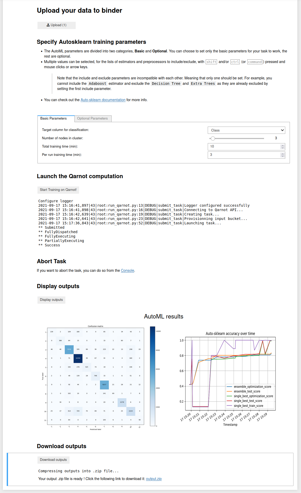

# AutoML Through Binder

Below is the newest addition to the `auto-sklearn` payload. It mainly includes the binder graphical interface for running AutoML, specifically Auto-sklearn on Qarnot through a jupyter notebook with minimal user intervention using a GUI based on jupyter widgets.

## Contents addition

* `automl.ipynb`: notebook with graphical interface to launch the task on Qarnot.
* `postBuild`: post build file specific to Binder, used to set the notebook as trusted on launch.
* `requirements.txt`: pip requirements file of python modules needed for the use case.
* `run_qarnot.py`: Python script for launching the task through the Qarnot SDK. Will be executed through the notebook.
* Here are links to a couple datasets that you can download on your end and upload to the binder session once it is running:
  * [phpH4DHsK.csv](https://www.openml.org/data/get_csv/1590940/phpH4DHsK) : Data that contains recordings of five people performing different activities. Each person wore four sensors (tags) while performing the same scenario five times. The problem consists of classifying the activity type for each entry given the collected sensor data (from 8 different types: walking, falling; sitting, etc...). The target column is **Class**
  * [BNG_wine.csv](https://www.openml.org/data/get_csv/150675/BNG_wine.arff) : Data that contains various information about wine samples like alcohol percentage, color intensity, Malic acid and more. The goal is to classify the wine quality as being either a 1, 2 or 3. The target column for is **class**

## How to run

* You can click on the following button to launch the notebook on Binder and get access to the same notebook
.

* You should have the following page load in your browser 

## Binder limitations

### File size

* By default, jupyter limits file size transfers to 10MB. Trying to upload a larger file restarts the notebook kernel.
* This has been increased to a theoretical limit of 500MB through the use of the `.jupyter/jupyter_notebook_config.py` file.
* However it seems that trying ot upload a file larger than ~300MB (could be a bit lower) crashes the browser tab.
* This appears to be a limitation of the browser.

### RAM

* While running, users are guaranteed at least 1GB of RAM, with a maximum of 2GB

### Time

* Binder will automatically shut down user sessions that have more than 10 minutes of inactivity (if you leave a jupyterlab window open in the foreground, this   will generally be counted as “activity”).

* Binder aims to provide up to six hours of session time per user session, or up to one cpu-hour for more computationally intensive sessions. Beyond that, we   cannot guarantee that the session will remain running

## Autosklearn parameters

* Password field for you Qarnot token
* Button to upload the data you want to run the classification on.
* As is mentioned in the notebook, only the first parameter (*target column*) has to be set by the user. The rest are optional and have default values.
* Two of the the parameters that a user might like to change are :
  * `total training time`: The total time (in minutes) allocated to Auto-sklearn for this training task. After which the training will stop and results are sent back.$
  * `per run training time`: Auto-sklearn trains multiple models in parallel in the given time limit. This parameter governs the time limit for each individual model. It can be set to around 10% of the total time for longer training times (*>60 minutes*) and more for shorter training times (*~33% for < 60 minutes*). There is no rule for this and the user should experiment with different values.
* The rest of the fields are optional and have default values like number of nodes in cluster, what estimators to include/exclude etc...more information about them can be found in the [Auto-sklearn doc](https://automl.github.io/auto-sklearn/master/api.html).
* Note about the estimators and pre-processors to include/exclude:
    * The last four fields are multiple choice selection, .i.e. You can select multiple entries using with <kbd>shift</kbd> and/or <kbd>ctrl</kbd>.
    * According to the API doc, the include and exclude parameters are incompatible with each other. Meaning that only one should be set. For example, you cannot include the `Adaboost` estimator and exclude the `Decision Tree` and `Extra Trees` as they are already excluded by setting the first include parameter.

## Launching and Visualizing results

* Once all the parameters have been set, you can launch the task on Qarnot by simply clicking on the button `Start Training on Qarnot!`.
* You will get a live progress of the different states of the task.
* Once Training is complete you can click on the `Display outputs` button to have a look at the graphs generated by the training (a confusion matrix and a plot of accuracy over time).
* It will look something like this.

